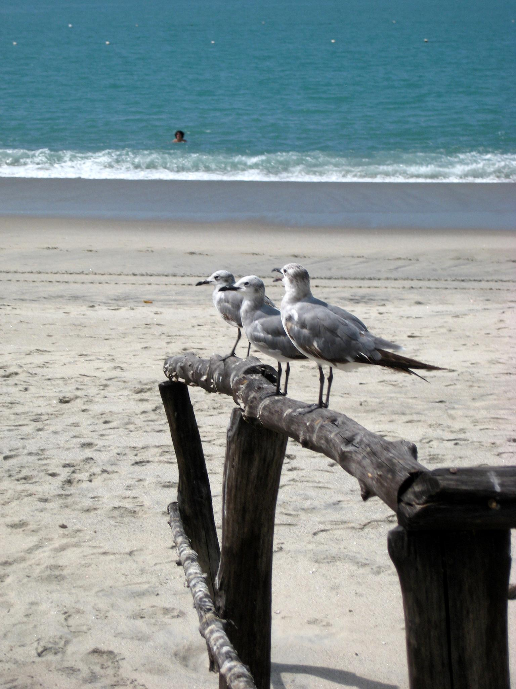

# Probando el Lightbox

Esta es una nota de prueba para verificar la funcionalidad del lightbox personalizado.

## Imagen única con lightbox

{.lightbox}

## Galería de múltiples imágenes

Estas tres imágenes se pueden navegar con las flechas del teclado:

{.lightbox}

{.lightbox}

{.lightbox}

## Imagen normal (sin lightbox)

Esta imagen NO tiene lightbox, es una imagen normal:

## Funcionalidades a probar

- ✅ Click en imagen con `.lightbox` abre el dialog
- ✅ Botón cerrar (X) cierra el lightbox
- ✅ Click en backdrop cierra el lightbox
- ✅ Tecla ESC cierra el lightbox
- ✅ Flechas ← / → navegan entre imágenes
- ✅ Contador muestra posición actual (ej: "2 / 3")
- ✅ Caption se muestra debajo de la imagen
- ✅ Spinner aparece mientras carga la imagen
- ✅ Botones prev/next se deshabilitan en primera/última imagen
- ✅ En imagen única, los botones de navegación están ocultos

## Navegación por teclado

- **Arrow Left** - Imagen anterior
- **Arrow Right** - Imagen siguiente
- **Home** - Primera imagen
- **End** - Última imagen
- **Escape** - Cerrar lightbox
- **Enter/Space** en thumbnail - Abrir lightbox

## Dark Mode

El lightbox debe adaptarse automáticamente al tema oscuro/claro del sitio.

## Prueba de Optimización con src/assets

Esta imagen está en `src/assets/` y debería ser optimizada por Astro automáticamente:

{.lightbox}
