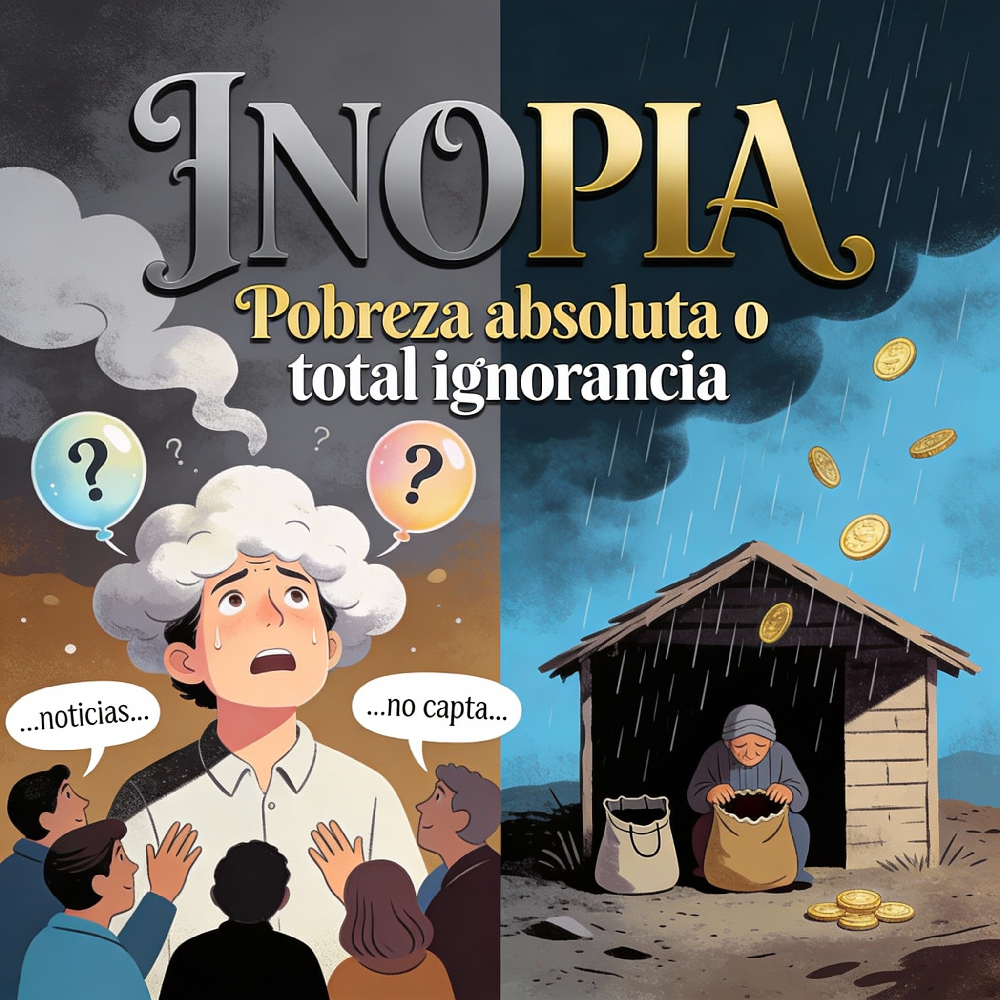

{.lightbox}

## ¿Qué significa *inopia*?

La palabra **inopia** apareció hace poco en una conversación con mi papá. Él la usa con cierta frecuencia, pero me di cuenta de que no es común escucharla en el día a día. Así que decidí investigar un poco más —qué significa exactamente, de dónde viene, y qué tan habitual es su uso hoy.

## Origen

**Inopia** proviene directamente del latín *inopia*, que significa *escasez* o *pobreza*. Es uno de esos términos que llegaron casi intactos al español desde el latín clásico y que mantienen su sentido fundamental de carencia.

## Significados según la RAE

La Real Academia Española recoge dos sentidos principales:

### 1. Sentido literal: pobreza o escasez  
Describe un estado de indigencia o carencia extrema.  
Ejemplo típico: *“vivía en la inopia más absoluta”*.

Es un término culto, más común en textos escritos que en conversaciones cotidianas.

### 2. Sentido figurado: estar desconectado o ignorante de algo  
La expresión **“estar en la inopia”** se usa para hablar de alguien que está completamente distraído, desconectado de lo que pasa a su alrededor o que simplemente no se enteró de algo.

En este sentido, la palabra ha evolucionado de describir una carencia material a describir una carencia informativa o de atención.

## Uso actual

Aunque su origen es totalmente material, hoy en día lo más frecuente es escucharla en su sentido figurado: alguien "en la inopia" es alguien distraído o uninformed. En países como Colombia también se usa en un contexto económico: estar sin plata, “quebrado”, “pelado”.

Es una palabra curiosa porque reúne dos mundos: la pobreza como falta real de recursos, y la pobreza metafórica de información o atención. El lenguaje, como siempre, hace de las suyas.

## Fuentes consultadas

- [RAE – Inopia](https://dle.rae.es/inopia)  
- [Diccionario del Estudiante – RAE](https://www.rae.es/diccionario-estudiante/inopia)  
- [Pregunte.es](https://www.pregunte.es/consulta/inicio.cmd?FORMULARIO=buscador&ACCION=getDetalleConsulta&NIC=17290)  
- [Significados.org](https://www.significadode.org/en%20la%20inopia.htm)  
- [Deleahora.com](https://deleahora.com/diccionario/inopia)  
- [Wiktionary](https://es.wiktionary.org/wiki/inopia)  
- …y varias referencias más incluidas en la investigación original.
