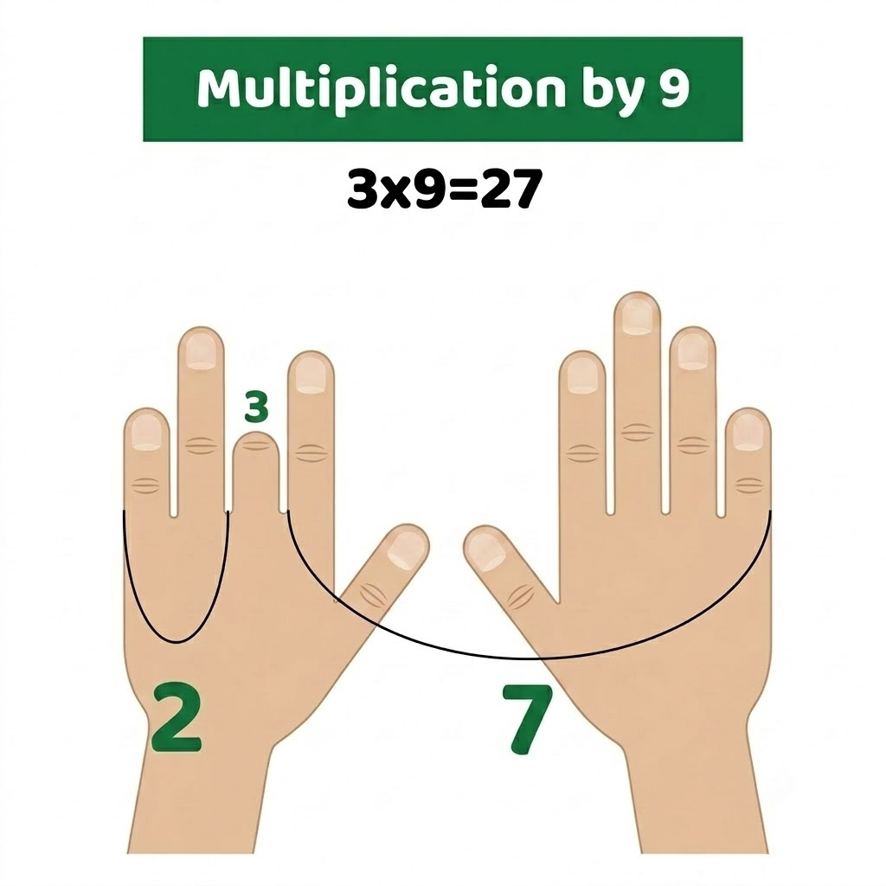
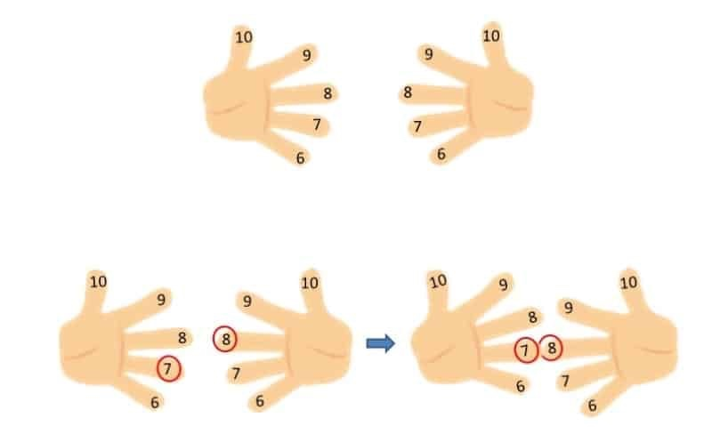

Mi hija de 8 años tiene TDAH y se le ha dificultado aprenderse de memoria las tablas de multiplicar. Ella entiende perfectamente el concepto, pero para agilizar operaciones más complejas —como la división— es útil tener los resultados disponibles sin pensar demasiado. Como se le ha dificultado, me puse a buscar herramientas para que pueda multiplicar sin depender de la memoria.

En el colegio, la profesora le enseñó una técnica para multiplicar por nueve. Yo encontré otra para multiplicar números entre 6 y 10. Escribo este post para tenerlo como referencia, y por si le sirve a alguien más que pase por aquí.

## Método para multiplicar por 9

Extiende ambas manos frente a ti con las palmas mirando hacia ti y cuenta los dedos desde la izquierda (meñique izquierdo = 1, hasta pulgar derecho = 10). Para multiplicar 9 × n, dobla el dedo número n. Los dedos que quedan a la izquierda del dedo doblado forman las decenas; los de la derecha, las unidades.

**Ejemplo: 9 × 3** — dobla el tercer dedo (dedo corazón de la mano izquierda). Quedan 2 dedos a la izquierda → 20, y 7 a la derecha → 7. Resultado: **27**.

## Método para multiplicar del 6 al 10

Extiende las manos con las palmas hacia el frente. Asigna un número a cada dedo de abajo hacia arriba: meñique = 6, anular = 7, medio = 8, índice = 9, pulgar = 10. Luego:

1. Junta las yemas de los dedos que representan los factores que quieres multiplicar.
2. Cuenta los dedos que quedan por encima del punto de unión en cada mano (sin los que se tocan) y multiplícalos entre sí.
3. Suma los dedos que se tocan más los que quedan por debajo del punto de unión en ambas manos, y multiplica ese total por 10.
4. Suma los dos resultados.

**Ejemplo: 7 × 8** — junta el anular (7) de la mano izquierda con el medio (8) de la derecha.

- Dedos por encima del punto de unión: mano izquierda tiene 3 (medio, índice, pulgar); mano derecha tiene 2 (índice, pulgar) → 3 × 2 = **6**
- Dedos que se tocan + por debajo: 2 en la izquierda (anular + meñique) + 3 en la derecha (medio + anular + meñique) = 5 → 5 × 10 = **50**
- Resultado: 6 + 50 = **56**

Estos trucos no reemplazan aprender las tablas, pero sí alivian la presión cuando el cerebro necesita un camino alternativo. Si tienes un niño que aprende diferente, vale la pena tenerlos cerca.
